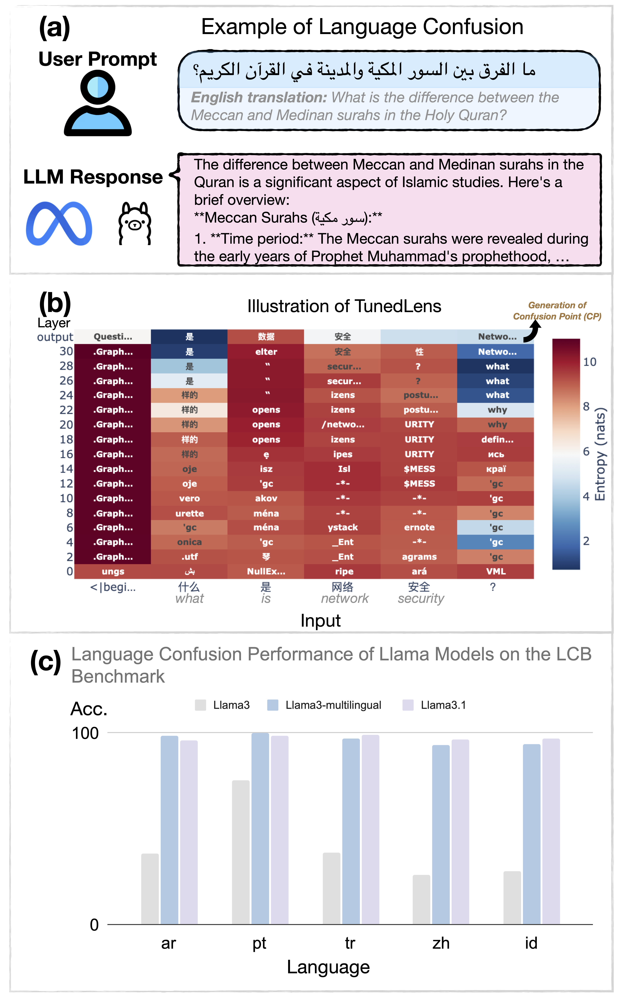

# Mechanistic Understanding and Mitigation of Language Confusion in English-Centric LLMs 


[](https://arxiv.org/pdf/2406.17764)  [](https://opensource.org/licenses/MIT)

This repo presents the code and data for the EMNLP 2025 Findings paper: "[*Mechanistic Understanding and Mitigation of Language Confusion in English-Centric Large Language Models*](https://arxiv.org/pdf/2505.16538)".
<p align="center">
  
</p>


## Overview
This project leverages the Language Confusion Benchmark (LCB) to mechanistically analyze language confusion across multiple datasets and languages. The repository includes scripts for generating model outputs, merging and evaluating results, identifying confusion points, and performing mechanistic analysis through neuron identification and intervention.

## Table of Contents

- [Datasets and Models](#datasets-and-models)
- [Pipeline and Usage](#pipeline-and-usage)
- [Citation](#citation)
- [License](#license)

---

## Datasets and Models
### Language Confusion Benchmark Overview

This work leverages the **Language Confusion Benchmark (LCB)** introduced by [Marchisio et al. (2024)](https://arxiv.org/abs/2403.12345), which systematically evaluates and quantifies "language confusion", the tendency of English-centric LLMs to mix up languages or produce outputs in unintended languages.

The original LCB contains crosslingual and monolingual prompt setups. This work focuses only on the monolingual set. The dataset type and language converage are demonstrated in the subsequent section.

### Data Source and Language Coverage

| Dataset Name | Dataset Source   | Languages Covered      | #Prompt | Prompt Example |
|--------------|------------------|-----------------------|---------|-----------------------------------------------------------------------------------------------------------------------------------|
| Aya          | Human-generated  | ar, en, pt, tr, zh    | 100     | 请简单介绍诗人李白的背景。<br>*(Briefly introduce the poet Li Bai.)*                         |
| Dolly        | MT post-edited   | ar, es, fr, hi, ru    | 100     | Qu'est-ce qui est plus important, l’inné ou l’acquis?<br>*(What is more important, nature or nurture?)* |
| Native       | Human-generated  | es, fr, ja, ko        | 100     | 콘크리트는 뭘로 만든거야?<br>*(What is concrete made of?)*                                  |
| Okapi        | Synthetic + MT  | ar, en, pt, zh,it, fr, de, id, es, vi  | 100     | Schreib einen Aufsatz von 500 Wörtern zum Thema KI. <br>*(Write a 500-word essay on AI..)*                         |

### Supported Models
This work investigated two types of English-centric models:
- **Llama-8b series**: Llama3-8b and its multilingual counterpart as well as its upgraded version Llama3.1-8b
  - Llama3-8b-instruct: `meta-llama/Meta-Llama-3-8B-Instruct `
  - Llama3.1-8b-instruct: `meta-llama/Meta-Llama-3.1-8B-Instruct`
  - Llama3-8b-multilingual: `lightblue/suzume-llama-3-8B-multilingual`
- **Mistral-7b sieres**: Mistral-7b together with its multilingual counterpart
  - Mistral-7b-instruct: `mistralai/Mistral-7B-Instruct-v0.2`
  - Mistral-7b-multilingual: `nthakur/mistral-7b-v02-multilingual-full-sft-27th-mar-basilisk`

---

## Pipeline and Usage
**Mechanistic Analysis and Mitigation of language confusion step by step**

### Overview of the Workflow
Below is a high-level overview of the workflow. You can click each step to jump directly to its detailed instructions:

1. [Step 1: Data Preparation](#step-1-data-preparation) - Output generation and computing evaluation metrics
2. [Step 2: Generating Confusion Points](#step-2-generating-confusion-points)
3. [Step 3: Neuron Identification and Intervention](#step-3-neuron-identification-and-intervention)

#### Argument choices
- `model_id`: `["Llama3-8b-instruct", "Llama3.1-8b-instruct", "Llama3-8b-multilingual", "Mistral-7b-instruct", "Mistral-7b-multilingual"]`
- `task`: `["monolingual", "crosslingual"]`
- `source`: `["okapi", "native", "aya", "dolly"]`
- `language`: `['ar','de','en','es','fr','id','it','pt','vi','zh','ja','ko','tr','hi','ru']`

### Step 1: Data Preparation
**Generating the outputs and computing evaluation metrics**  
1. **Generating the outputs**
    - Choose the dataset (`task`, `source`), language id (`language`), and the model (`model_id`).
    - Generate the output:
    ```python
    python generate_outputs.py --model_id  [model_id] \ 
    --task [task] --source [source] --language [language]
    ```
    The output generation files are stored in the directory `outputs/[model_id]` by default.

2. **Merging the output files**
    - Merge all generation files of a specific model into a single file:
    ```python
    python utils/merge_files.py outputs [model_id]
    ```
    The merged file is stored at `outputs/[model_id].csv` by default.

3. **Computing the metrics**
  ```python
  python utils/compute_metrics.py outputs/[model_id].csv 
  ```
  The results files are stored at `outputs/[model_id]_results.csv` and `outputs/[model_id]_errors.csv`, respectively, by default.

4. **Appending error type label to the original generation output files**
  ```python
  python utils/append_error.py [model_id]
  ```

### Step 2: Generating Confusion Points
  ```python
    python generate_cp.py --model_id  [model_id] \ 
    --task [task] --source [source] --language [language]
  ```

### Step 3: Neuron identification and intervention
1. Neuron location.
  ```python find_neurons.py --model_id  [model_id] \ 
  --task [task] --source [source] --language [language]
  ```
2. Neuron intervention
  ```python neuron_editing.py --model_id  [model_id] \ 
  --task [task] --source [source] --language [language]
  ```

At last, use the `compute_metric.py` script to measure the language confusion performance on the outputs generated by the neuron-intervened models. 

---

## Citation

```bibtex
@inproceedings{nie2025mechanistic,
    title = "Mechanistic Understanding and Mitigation of Language Confusion in English-Centric Large Language Models",
    author = "Nie, Ercong and Schmid, Helmut and Sch{\"u}tze, Hinrich",
    booktitle = "Findings of the Association for Computational Linguistics: EMNLP 2025",
    month = nov,
    year = "2025",
    address = "Suzhou, China",
    publisher = "Association for Computational Linguistics",
}
```

---

## License

This project is licensed under the [MIT License](LICENSE).